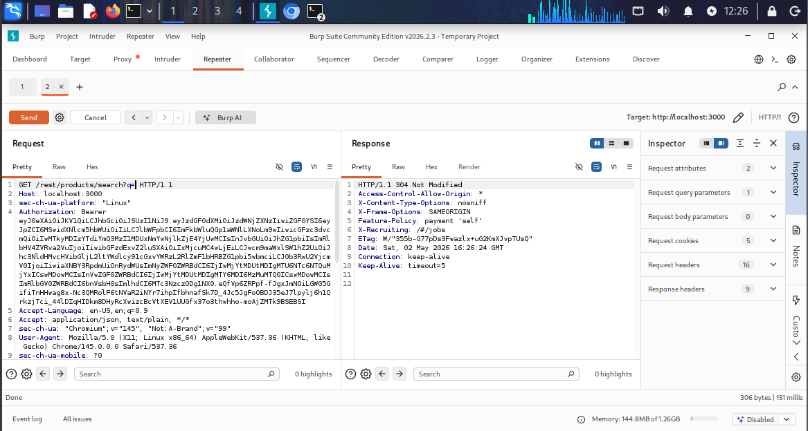
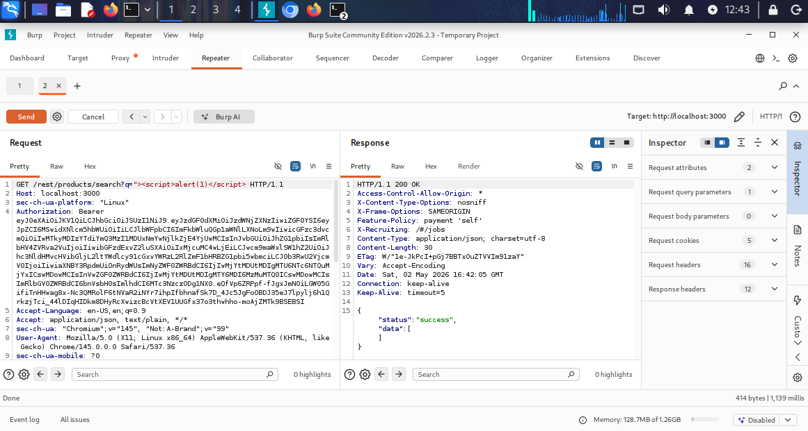

# API Security Testing using Burp Suite

## 📌 Overview
This project demonstrates manual API security testing performed using Burp Suite in a controlled lab environment. The objective was to analyze backend endpoints and test for common security weaknesses.

---

## 🛠️ Tools Used
- Burp Suite  
- Web Browser  

---

## 🔍 Testing Methodology
- Intercepted API requests using Burp Suite  
- Sent requests to Repeater for manipulation  
- Tested input validation and parameter handling  
- Performed basic authentication and access control checks  

---

## 🧪 Testing Performed

### 1. Parameter Manipulation
- Modified query parameters to observe response changes  

### 2. Authentication Testing
- Removed session cookies and tested access  

### 3. Input Injection Testing
- Attempted XSS payload injection in API parameters  

---

## ⚠️ Observations

### 🔹 Endpoint Tested:
GET /rest/products/search

### 🔹 Payload Used:
``

### 🔹 Result:
- Application returned an empty response  
- No payload reflection or execution observed  

---

## 📸 Evidence

**Original Request:**  

**Modified Request (Payload Injection) and Response:**  

---

## 📊 Conclusion
The tested API endpoints handled input securely in the performed scenarios. No critical vulnerabilities were identified during testing.

---

## ⚖️ Ethical Note
This project was conducted in a controlled lab environment for educational purposes only.
